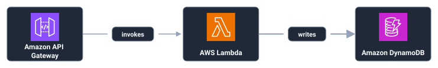
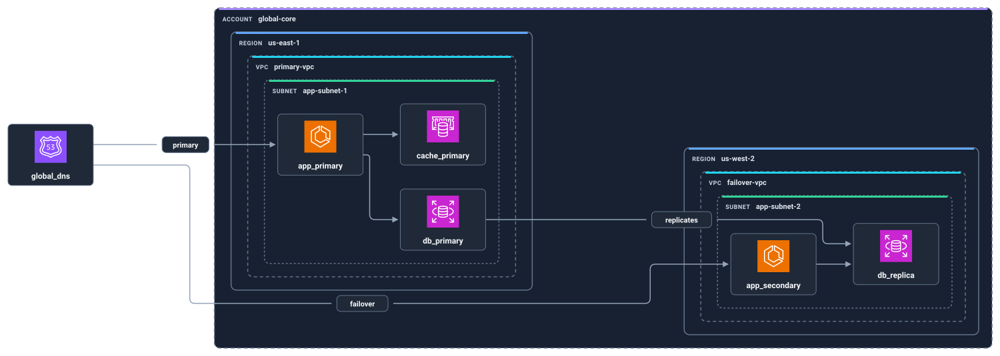

# ArchLex

Use ArchLex to turn text definitions into accessible SVG architecture diagrams
in browsers and Node.js. Register AWS, Google Cloud, or Kubernetes providers to
resolve resources, validate relationships, and apply official architecture
icons.

## Visual Output

### Serverless API



```archlex
direction LR
provider aws

api-gateway -[invokes]-> lambda -[writes]-> dynamodb
```

### Multi-Region Infrastructure



```archlex
direction LR
provider aws
validation normal

account global-core {
  region us-east-1 {
    vpc primary-vpc {
      subnet app-subnet-1 {
        app_primary: ecs
        db_primary: rds
        cache_primary: elasticache
        app_primary > cache_primary
        app_primary > db_primary
      }
    }
  }
  region us-west-2 {
    vpc failover-vpc {
      subnet app-subnet-2 {
        app_secondary: ecs
        db_replica: rds
        app_secondary > db_replica
      }
    }
  }
}

global_dns: route53
global_dns -[primary]-> app_primary
global_dns -[failover]-> app_secondary
db_primary -[replicates]-> db_replica
```

## Supported Providers

Register the providers you need in one ArchLex instance.

| Provider | ID | Package | Example resources |
| --- | --- | --- | --- |
| AWS | `aws` | `@archlex/aws` | Lambda, ECS, RDS, S3 |
| Google Cloud | `gcp` | `@archlex/gcp` | Cloud Run, GKE, Cloud SQL, BigQuery |
| Kubernetes | `k8s` | `@archlex/k8s` | Deployment, Service, Ingress, StatefulSet |

Select one provider in each source with `provider aws`, `provider gcp`, or
`provider k8s`. Register all three providers once, then render sources for any of
them through the same API.

## Features

- Model resources with shorthand relationships and nested containment blocks.
- Validate resource names, containment, and provider-specific relationships.
- **Context-aware editor completions** with human-readable search across 441 cloud resources (194 AWS, 185 GCP, 62 K8s).
- **Fuzzy matching** - type "elastic kubernetes" to find Amazon EKS, or "relational" for RDS and Aurora.
- **Grammar-aware suggestions** - different completions after `:` (resources), `[` (relationships), or in directives.
- **Semantic ranking** - results ordered by prefix match, search relevance, and relationship compatibility.
- Render accessible SVG with ARIA attributes and keyboard focus support.
- Choose light or dark themes with provider architecture icons.
- Inspect structured diagnostics alongside partial diagrams when a source needs
  correction.
- Reproduce layouts through stable IDs and deterministic node ordering.
- Use the same DOM-neutral core with React, Vue, Svelte, vanilla JavaScript, or
  Node.js 22 and later.

## Quick Start

### Install

```bash
npm install @archlex/core @archlex/aws @archlex/gcp @archlex/k8s
```

### Register Providers and Render

```typescript
import {
  awsProvider,
  createArchLex,
  gcpProvider,
  k8sProvider,
} from "@archlex/core";

const archlex = createArchLex({
  providers: [awsProvider(), gcpProvider(), k8sProvider()],
});

const source = `
direction LR
provider aws
validation normal

alb -[routes]-> ecs
ecs -[writes]-> rds
`;

const result = await archlex.render(source);

for (const diagnostic of result.diagnostics) {
  console.warn(diagnostic.code, diagnostic.message);
}

console.log(result.svg);
```

Change the `provider` directive and resource names to render a Google Cloud or
Kubernetes diagram. Keep the same provider registration.

## Language Intelligence

`@archlex/language-service` provides editor-neutral code completion:

```typescript
import { createCompletionEngine, analyzeLanguageDocument } from "@archlex/language-service";

const catalog = archlex.getCatalog();
const engine = createCompletionEngine(catalog);

const source = "provider aws\nservice: elastic kubernetes";
const document = analyzeLanguageDocument(source);
const completions = engine.complete(document, source.length);

// Returns: [{ label: "Amazon EKS", insertText: "eks", kind: "resource", ... }]
```

**Key features:**
- Catalog-driven suggestions for all 441 cloud resources
- Human-readable search (type "serverless compute" to find Lambda)
- Context-aware filtering by provider, scope, and grammar position
- Semantic ranking by prefix match and search relevance
- Works with Monaco, VSCode, CodeMirror, or any editor

See the [language-service README](packages/language-service/README.md) for full documentation and Monaco integration examples.

## Playground

Run the interactive editor from a local checkout:

```bash
git clone https://github.com/baires/archlex.git
cd archlex
pnpm install
pnpm dev:playground
```

Open [http://localhost:5173](http://localhost:5173).

## Documentation

- [Getting Started](docs/README.md): documentation map and guide structure
- [Language Specification](docs/specs/language.md): syntax and grammar
- [Public API](docs/specs/public-api.md): JavaScript and TypeScript APIs
- [AWS Semantics](docs/specs/aws-semantics.md): AWS resources and validation
- [Google Cloud Semantics](docs/specs/gcp-semantics.md): Google Cloud resources
  and validation
- [Kubernetes Semantics](docs/specs/k8s-semantics.md): Kubernetes resources,
  containment, and validation
- [Error Reference](docs/errors/README.md): diagnostic codes and remediation
- [Relationship Types](docs/guides/relationship-types.md): built-in and custom
  relationships
- [System Architecture](docs/architecture/system-architecture.md): package
  boundaries and execution pipeline

## Packages

| Package | Responsibility |
| --- | --- |
| `@archlex/core` | Coordinates parsing, validation, layout, and rendering |
| `@archlex/parser` | Parses the ArchLex language with Chevrotain |
| `@archlex/layout-elk` | Calculates graph layouts with ELK |
| `@archlex/renderer-svg` | Produces accessible SVG with themes and icons |
| `@archlex/aws` | Defines AWS resources, icons, and semantic rules |
| `@archlex/gcp` | Defines Google Cloud resources, icons, and semantic rules |
| `@archlex/k8s` | Defines Kubernetes resources, icons, and semantic rules |
| `@archlex/model` | Publishes shared data structures and interfaces |
| `@archlex/diagnostics` | Publishes diagnostic codes and formatting tools |

## Requirements

- Node.js 22.0.0 or later
- pnpm 9.0.0 or later for workspace development
- A browser with ES2022 support for browser applications

## Contributing

Read [CONTRIBUTING.md](CONTRIBUTING.md) for setup commands, package conventions,
and verification requirements.

## License

We publish ArchLex under the MIT License. Read [LICENSE](LICENSE) for the terms.

## Acknowledgments

We use official icon sets from these projects:

- [AWS Architecture Icons](https://aws.amazon.com/architecture/icons/)
- [Google Cloud Architecture Icons](https://cloud.google.com/icons)
- [Kubernetes Community Icons](https://github.com/kubernetes/community/tree/43d6605709182dedb495a864930ece08666a1e67/icons)

We use the [Eclipse Layout Kernel](https://www.eclipse.org/elk/) to calculate
graph layouts.
