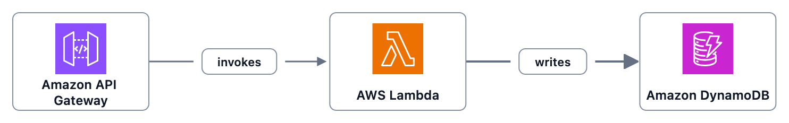
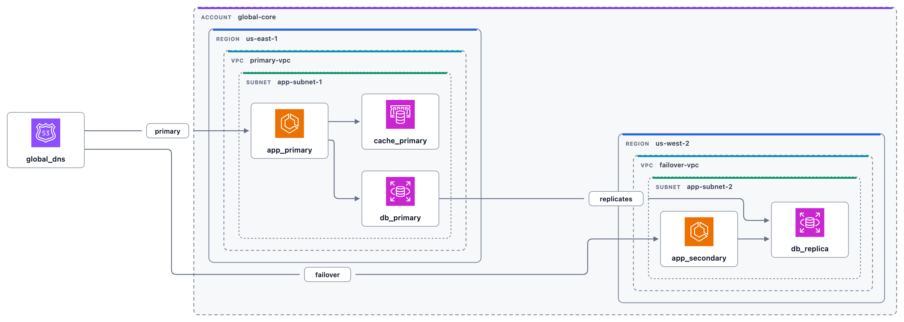

# ArchLex

Ask Claude, Cursor, or Codex to diagram your cloud. ArchLex validates AWS,
GCP, and Kubernetes — then renders official-icon SVG you can read, diff, and
share.

## 10 seconds

```bash
npx skills add baires/archlex
```

```bash
claude mcp add --transport http archlex https://mcp.archlex.dev/mcp
```

Then ask:

> Diagram a serverless API on AWS with API Gateway, Lambda, and DynamoDB.

You get a validated diagram, the exact ArchLex source, and a
[playground](https://playground.archlex.dev) link. No API key.

More clients: [Use with AI agents](https://docs.archlex.dev/guides/agents).

## Visual output

### Serverless API



```archlex
direction LR
provider aws

api-gateway -[invokes]-> lambda -[writes]-> dynamodb
```

### Multi-region infrastructure



```archlex
direction LR
provider aws

account global-core {
  region us-east-1 {
    vpc primary-vpc {
      subnet app-subnet-1 {
        app_primary: ecs
        db_primary: rds
        cache_primary: elasticache
        app_primary > cache_primary
        app_primary > db_primary
      }
    }
  }
  region us-west-2 {
    vpc failover-vpc {
      subnet app-subnet-2 {
        app_secondary: ecs
        db_replica: rds
        app_secondary > db_replica
      }
    }
  }
}

global_dns: route53
global_dns -[routes]->|primary| app_primary
global_dns -[routes]->|failover| app_secondary
db_primary -[replicates]-> db_replica
```

The source stays reviewable. The renderer stays deterministic.

## Language

```archlex
direction LR
provider aws

vpc production {
  subnet public {
    api-gateway["API Gateway"] > lambda["Auth Service"]
  }
  subnet private {
    lambda["Auth Service"] -[writes]->|SQL| dynamodb["Users Table"]
  }
}
```

- **Directives:** `provider aws|gcp|k8s`, `direction LR|RL|TB|BT`,
  `validation normal|strict|off`, `theme light|dark`
- **Resources:** `rds`, `primary: rds`, `primary: rds["Primary DB"]`
- **Edges:** `a > b`, `a -> b`, `a -[writes]-> b`, `a -[writes]->|SQL| b`

[Language specification](docs/specs/language.md) ·
[Playground](https://playground.archlex.dev)

## MCP

Remote server: `https://mcp.archlex.dev/mcp`

| Client | Setup |
| --- | --- |
| Claude Code | `claude mcp add --transport http archlex https://mcp.archlex.dev/mcp` |
| Codex | `codex mcp add archlex --url https://mcp.archlex.dev/mcp` |
| Cursor | `{ "mcpServers": { "archlex": { "url": "https://mcp.archlex.dev/mcp" } } }` |

Tools: `render_diagram`, `validate_diagram`, `get_cloud_catalog`,
`generate_playground_url`.

## Embed in an app

```bash
npm install @archlex/core @archlex/aws @archlex/gcp @archlex/k8s
```

```typescript
import {
  awsProvider,
  createArchLex,
  gcpProvider,
  k8sProvider,
} from "@archlex/core";

const archlex = createArchLex({
  providers: [awsProvider(), gcpProvider(), k8sProvider()],
});

const result = await archlex.render(`
direction LR
provider aws

alb -[routes]-> ecs
ecs -[writes]-> rds
`);

console.log(result.svg);
```

[Getting started](https://docs.archlex.dev/getting-started) ·
[Public API](docs/specs/public-api.md)

## Providers

| Provider | ID | Package | Example resources |
| --- | --- | --- | --- |
| AWS | `aws` | `@archlex/aws` | Lambda, ECS, RDS, S3 |
| Google Cloud | `gcp` | `@archlex/gcp` | Cloud Run, GKE, Cloud SQL, BigQuery |
| Kubernetes | `k8s` | `@archlex/k8s` | Deployment, Service, Ingress, StatefulSet |

## Documentation

- [Use with AI agents](https://docs.archlex.dev/guides/agents)
- [Language specification](docs/specs/language.md)
- [MCP server](docs/guides/mcp-server.md)
- [AWS](docs/specs/aws-semantics.md) · [GCP](docs/specs/gcp-semantics.md) ·
  [Kubernetes](docs/specs/k8s-semantics.md)
- [Error reference](docs/errors/README.md)

## License

MIT. Icons from [AWS](https://aws.amazon.com/architecture/icons/),
[Google Cloud](https://cloud.google.com/icons), and
[Kubernetes](https://github.com/kubernetes/community/tree/43d6605709182dedb495a864930ece08666a1e67/icons).
Layout by [ELK](https://www.eclipse.org/elk/).
