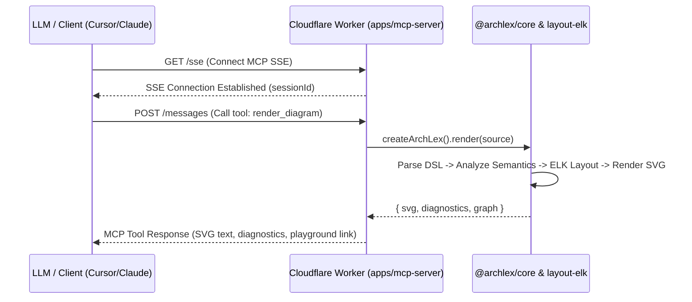

# Remote MCP Server Design (`apps/mcp-server`)

## Overview

The ArchLex Remote MCP Server enables Large Language Models (Claude, ChatGPT, Cursor, custom agents) to generate, validate, and inspect cloud architecture diagrams powered by `@archlex/core`. It runs as a standalone Cloudflare Worker application deployed at `mcp.archlex.dev` (or Cloudflare Worker subdomain), communicating over Server-Sent Events (SSE) and HTTP POST JSON-RPC via `@modelcontextprotocol/sdk`.

---

## 1. Monorepo Integration & Architecture

### Package Location & Structure
- **Path**: `apps/mcp-server`
- **Type**: Cloudflare Worker application managed via `wrangler` and Turbo.
- **Dependencies**:
  - `@archlex/core`, `@archlex/aws`, `@archlex/gcp`, `@archlex/layout-elk`, `@archlex/model` (monorepo workspace dependencies)
  - `@modelcontextprotocol/sdk` (MCP server SDK for TypeScript)
  - `itty-router` or standard `fetch` handler for Worker routing
  - `wrangler` (dev dependency)

### Monorepo Scripts (`package.json` & `turbo.json`)
```json
{
  "name": "@archlex/mcp-server",
  "version": "0.1.0",
  "private": true,
  "type": "module",
  "scripts": {
    "dev": "wrangler dev",
    "build": "wrangler deploy --dry-run",
    "deploy": "wrangler deploy",
    "typecheck": "tsc --noEmit",
    "test": "vitest run"
  }
}
```

### Endpoints
1. `GET /sse`: Initiates Server-Sent Events transport stream for MCP connections.
2. `POST /messages`: Handles incoming JSON-RPC requests for an active SSE session.
3. `GET /health`: Health check endpoint returning status, version, and supported providers.
4. `GET /info`: Metadata endpoint for MCP discovery and interactive instructions.

---

## 2. MCP Capabilities (Tools, Resources, Prompts)

### Tools

1. `render_diagram`
   - **Description**: Parses ArchLex DSL shorthand text, validates architecture semantics, computes layout using `@archlex/layout-elk`, and returns SVG string, layout metadata, diagnostics, and playground URL.
   - **Parameters**:
     - `source` (string, required): ArchLex diagram source code.
     - `theme` ("light" | "dark", optional): Rendering theme (default: "dark").
     - `direction` ("LR" | "RL" | "TB" | "BT", optional): Layout orientation.
   - **Returns**:
     - `svg`: Full SVG string output.
     - `diagnostics`: List of errors/warnings with line numbers.
     - `playground_url`: Direct deep-link URL to edit diagram in ArchLex Playground.

2. `validate_diagram`
   - **Description**: Lightweight check of ArchLex DSL syntax and cloud semantic rules without generating SVG output.
   - **Parameters**:
     - `source` (string, required): ArchLex diagram source code.
     - `provider` ("aws" | "gcp", optional): Default cloud provider.
   - **Returns**:
     - `valid`: boolean status.
     - `diagnostics`: Detailed error and warning list with diagnostic codes (e.g. `AL-SEM-UNKNOWN-RESOURCE`).

3. `get_cloud_catalog`
   - **Description**: Returns available cloud providers, supported service kinds (e.g. `rds`, `ecs`, `lambda`), scopes/boundaries (`vpc`, `subnet`, `account`, `region`), and valid edge relationship kinds (`connects`, `writes`, `encrypts`, `logs`, etc.).
   - **Parameters**:
     - `provider` ("aws" | "gcp" | "all", optional): Filter catalog by provider.
   - **Returns**: Catalog metadata JSON.

4. `generate_playground_url`
   - **Description**: Encodes ArchLex DSL code into a shareable playground URL for interactive viewing and manual editing in `playground.archlex.dev`.
   - **Parameters**:
     - `source` (string, required).
   - **Returns**: `url` string.

### Resources

1. `archlex://docs/dsl-syntax`
   - Cheat sheet and grammar reference for ArchLex shorthand language (nodes, scopes, relationship arrows, directives).

2. `archlex://catalog/aws` & `archlex://catalog/gcp`
   - Structured specification of supported cloud icons and semantic containment rules.

3. `archlex://examples/{id}`
   - Sample architecture patterns (e.g., `aws-microservices`, `gcp-data-pipeline`, `serverless-api`).

### Prompts

1. `architect_cloud_infrastructure`
   - Guided system prompt instructing LLMs how to output valid ArchLex DSL diagrams for user requirements.

---

## 3. Data Flow & Execution in Cloudflare Worker



- Executed entirely in V8 edge isolates without Node.js DOM dependencies.
- `@archlex/layout-elk` uses `elkjs` JavaScript layout bundle, fully compatible with Web Standard APIs.

---

## 4. Verification & Deployment Plan

### Automated Tests
- Unit tests for MCP server tool handlers using `vitest`.
- E2E MCP transport test simulating SSE and JSON-RPC message exchange.

### Deployment Instructions (`docs/cloudflare-pages.md` update)
- Add deployment step for `archlex-mcp` worker:
  `pnpm --filter @archlex/mcp-server deploy`
